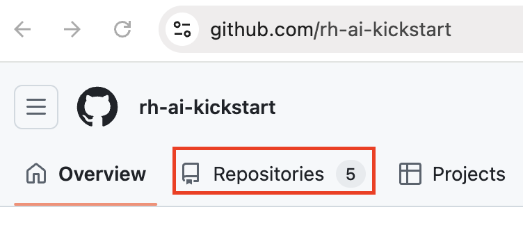
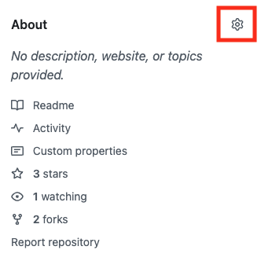

# Welcome to the contributor's guide (FAQ)! :computer: 

Here you'll find details on how to contribute AI kickstarts!

## Table of contents

* [How are AI kickstarts organized?](#how-are-ai-kickstarts-organized)
* [What are the repository requirements?](#what-are-the-repository-requirements)
* [Is there a template repository?](#is-there-a-template-repository)
* [How do I create a new kickstart?](#how-do-i-create-a-new-kickstart)
* [Do I have to create an Arcade?](#do-i-have-to-create-an-arcade)
* [Can I deploy and share a working example?](#can-i-deploy-and-share-a-working-example) 
* [How are kickstarts maintained?](#how-are-kickstarts-maintained)
* [What is the ai-kickstart-contrib repository?](#what-is-the-ai-kickstart-contrib-repository)

## How are AI kickstarts organized? 

Every AI kickstart is its own repository. We do this so they are easy to browse,
clone and deploy! AI kickstarts are collected here in the 
[AI kickstart GitHub Organization](https://github.com/rh-ai-kickstart). 

Here's what it looks like: 

```
rh-ai-kickstart/
├── [vllm-cpu]()/
│   ├── README.md 
│   ├── assets/images/
│   └── helm/
└── [vllm-tool-calling]()/
    ├── README.md 
    ├── assets/images/
    └── vllm-tool-calling/
```

## What are the repository requirements? 


* A descriptive repo name makes your kickstart easy to find and understand 
* Include a description for your repository
* `README.md` 
* Put the images your README uses in the `assets/images/` folder

Here's why: 

* READMEs are extracted and used for promotion on
[ai-on-openshift.io](https://ai-on-openshift.io/) 
and 
[redhat.com](https://redhat.com) (**future, TBD**). 
* GitHub Actions automate extraction so resources should be organized consistently

## Is there a template repository? 

Yes. We got you! 

The `ai-kickstart-template` repository will prepopulate your repository with: 
 
* a README.md file - **NOTE** You'll want to replace the text! 
* `assets/images/` folder to store images supporting your README
* `.github/workflows/` GH Actions to manually submit a PR for publication

## How do I create a new kickstart? 

### 1. Click "Repositories" in the [AI kickstart
org](https://github.com/rh-ai-kickstart)



### 2. Click "New repository" (top right) 


### 3. Click "No template" and select `rh-ai-kickstart/ai-kickstart-template`


### 4. Give your repository a name, make it Public and "Create repository"  

### 5. Build! :rocket:

### 6. P.S. Remember to update *placeholder* text in the template README

### 7. P.P.S Remember to add a description to your repo 

1. Click the gear icon in the top right of your repository

2. Add a short description 


## Do I have to create an Arcade? 

You don't *have* to create an Arcade, but it is recommended. Remember: not all
users will have immediate access to an environment when they find your 
kickstart. Arcades let users experience the example even if they aren't ready 
to deploy just yet. 

Don't forget to include a link to the Arcade in your README file. And, if you 
want to go the extra mile, you can export the Arcade as a video and embed it 
in your README. 

Red Hatters can get started by searching `"interactive experiences (Arcade)"` on
the Source.

## Can I deploy and share a working example? 

Yes, the AI BU runs an OpenShift AI cluster for any Red Hatter to use. You can
deploy your example and share it internally. Reach out using internal channels
for help. 

## How are kickstarts maintained? 

AI kickstarts are maintained by their owner. Your kickstarts are maintained by
you. We ask for prompt attention to known issues and requests. If necessary
actions are not completed, we may pause the promotion of your AI kickstart on
redhat.com. 

## What is the ai-kickstart-contrib repository? 

This is where:

* general management of AI kickstarts happens
* general issues are submitted 
* membership requests are made
* discussions, or  
* planning happens

